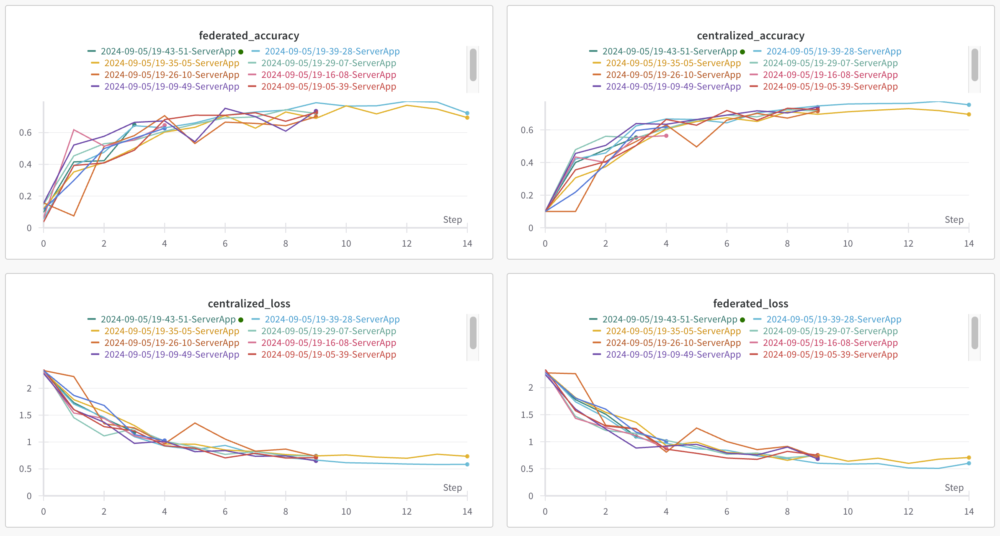

# Federated Learning with PyTorch and Flower (Advanced Example with Low level API)

> \[!CAUTION\]
> This example uses Flower's low-level API which is a preview feature and subject to change. If you are not ready for the low-level API, the [advanced-pytorch](https://github.com/adap/flower/tree/main/examples/advanced-pytorch) example demonstrates near identical functionality but using higher level components such as Flower's _Strategies_ and _NumPyClient_.

This example demonstrates how to use Flower's low-level API to write a `ServerApp` a _"for loop"_, enabling you to define what a "round" means and construct [Message](https://flower.ai/docs/framework/ref-api/flwr.common.Message.html) objects to communicate arbitrary data structures as [RecordSet](https://flower.ai/docs/framework/ref-api/flwr.common.RecordSet.html) objects. Just like the the counterpart to this example using the strategies API (find it in the parent directory), it:

1. Save model checkpoints
2. Save the metrics available at the strategy (e.g. accuracies, losses)
3. Log training artefacts to [Weights & Biases](https://wandb.ai/site)
4. Implement a simple decaying learning rate schedule across rounds

> \[!NOTE\]
> The code in this example is particularly rich in comments, but the code itself is intended to be easy to follow. Note that in `task.py` you'll make use of many of the same components (model, train/evaluate functions, data loaders) as were first presented in the [advanced-pytorch](https://github.com/adap/flower/tree/main/examples/advanced-pytorch/pytorch-example) in the parent directory that uses strategies.

This examples uses [Flower Datasets](https://flower.ai/docs/datasets/) with the [Dirichlet Partitioner](https://flower.ai/docs/datasets/ref-api/flwr_datasets.partitioner.DirichletPartitioner.html#flwr_datasets.partitioner.DirichletPartitioner) to partition the [Fashion-MNIST](https://huggingface.co/datasets/zalando-datasets/fashion_mnist) dataset in a non-IID fashion into 50 partitions.


> \[!TIP\]
> You can use Flower Datasets [built-in visualization tools](https://flower.ai/docs/datasets/tutorial-visualize-label-distribution.html) to easily generate plots like the one above.

```shell
advanced-pytorch-low-level
├── pytorch_example_low_level
│   ├── __init__.py
│   ├── client_app.py   # Defines your ClientApp
│   ├── server_app.py   # Defines your ServerApp
│   ├── task.py         # Defines your model, training and data loading
│   └── utils.py        # Defines utility functions
├── pyproject.toml      # Project metadata like dependencies and configs
└── README.md
```

### Install dependencies and project

Install the dependencies defined in `pyproject.toml` as well as the `pytorch_example_low_level` package.

```bash
pip install -e .
```

## Run the project

The low-level `ServerApp` implemented in this example will go through these steps on each round:

1. Uniformly sample a % of the connected nodes
2. Involve the selected nodes in a round of training, where they'll train the global model on their local data.
3. Aggregate the received models
4. Query all nodes and those that return `True` will be consider in the next step
5. Share the global model with selected nodes so they evaluate it on their local validation sets
6. Compute the average accuracy and loss from the received results.

The low-level API also gives you full control on what gets logged when running you Flower apps. Running this example as shown below will generate a log like this:

```bash
...
INFO :
INFO :      🔄 Starting round 2/10
INFO :      Sampled 10 out of 50 nodes.
INFO :      📥 Received 10/10 results (TRAIN)
INFO :      💡 Centrally evaluated model -> loss:  1.6017 /  accuracy:  0.4556
INFO :      🎉 New best global model found: 0.455600
INFO :      📨 Received 12/50 results (QUERY)
INFO :      ✅ 6/50 nodes opted-in for evaluation (QUERY)
INFO :      📥 Received 6/6 results (EVALUATE)
INFO :      📊 Federated evaluation -> loss: 1.605±0.116 / accuracy: 0.522±0.105
INFO :
...
```

By default, the metrics: {`centralized_accuracy`, `centralized_loss`, `federated_evaluate_accuracy`, `federated_evaluate_loss`} will be logged to Weights & Biases (they are also stored to the `results.json` previously mentioned). Upon executing `flwr run` you'll see a URL linking to your Weight&Biases dashboard wher you can see the metrics.



### Run with the Simulation Engine

With default parameters, 20% of the total 50 nodes (see `num-supernodes` in `pyproject.toml`) will be sampled in each round. By default `ClientApp` objects will run on CPU.

> \[!TIP\]
> To run your `ClientApps` on GPU or to adjust the degree or parallelism of your simulation, edit the `[tool.flwr.federations.local-simulation]` section in the `pyproject.tom`.

```bash
flwr run .

# To disable W&B
flwr run . --run-config use-wandb=false
```

You can run the app using another federation (see `pyproject.toml`). For example, if you have a GPU available, select the `local-sim-gpu` federation:

```bash
flwr run . local-sim-gpu
```

You can also override some of the settings for your `ClientApp` and `ServerApp` defined in `pyproject.toml`. For example:

```bash
flwr run . --run-config "num-server-rounds=5 fraction-clients-train=0.5"
```

### Run with the Deployment Engine

> \[!NOTE\]
> An update to this example will show how to run this Flower application with the Deployment Engine and TLS certificates, or with Docker.
